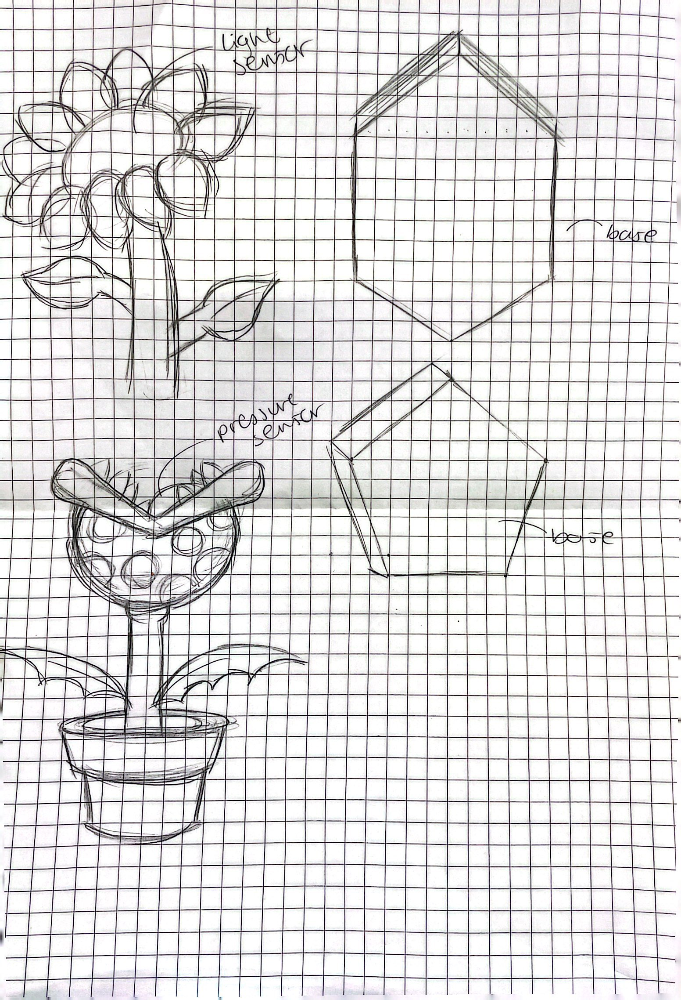

# Working on the Dancing Robot - Base
### Sketches
- We wanted to create a robot based on nature to create an oxymoronic combination. Below are the prelimenary sketches we made:

- the first one was designed after a sunflower and had a hexagon-shaped base. we liked the idea that sunflowers turn to face the sun and thought of mimicking this with a light sensor that would communicate a change of rotation or movement to the motor.
- the second one is modeled after the venus fly trap plant from the super mario games, and we were hoping to also mimick the natural tendency for it to close upon detecting a prey by using a pressure (or light) sensor. This design had a pentagon shape.
- ultimately, we decided to go with the second design as to challenge ourselves with the complex and comical shape. Although we did not get a pentagon-shaped base, we were able to get a big enough rectangular base that would allow us to integrate the tube design and possible surrounding grass elements (to mimick the 2d space the games are set in).
### Base Process
- After being given the rectangular base, we started sketching out where all the parts would go. 
